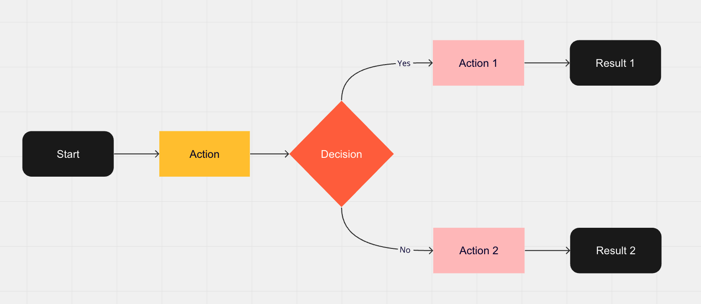

# Project Title

The project title should be a clear and concise representation of the project. It should grab the attention of potential users and make them want to learn more about what you are offering.

## Table of Contents

Include a table of contents to make it easy for users to navigate through your readme file.

- [Project Title](#project-title)
- [Table of Contents](#table-of-contents)
- [Description](#description)
- [Installation](#installation)
- [Usage](#usage)
- [Contributing](#contributing)
- [License](#license)

## Description

In this section, provide a detailed description of your project. Explain what it does, how it works, and what sets it apart from other similar projects. Use clear and concise language to make it easy for users to understand.

Include any relevant images or diagrams to help explain your project. For example, here is an image of the project architecture:



## Installation

In this section, provide step-by-step instructions on how to install your project. Include any dependencies that need to be installed, and any configuration that needs to be done before the project can be run.

```bash
npm install my-project
```

## Usage

In this section, provide examples of how to use your project. Include any command-line examples or code snippets that demonstrate how to use your project.

```bash
my-project --input input.txt --output output.txt
```

## Contributing

In this section, provide guidelines for how users can contribute to your project. Include information about how to submit bug reports, feature requests, and pull requests.

## License

In this section, provide information about the license under which your project is released. Include a link to the license file, if applicable.

This project is licensed under the MIT License - see the [LICENSE.md](LICENSE.md) file for details.

## Additional Resources

Include any additional resources that may be helpful to users, such as links to documentation, tutorials, or blog posts.

- [Project Homepage](https://www.example.com/)
- [Documentation](https://www.example.com/docs)
- [Blog](https://www.example.com/blog)